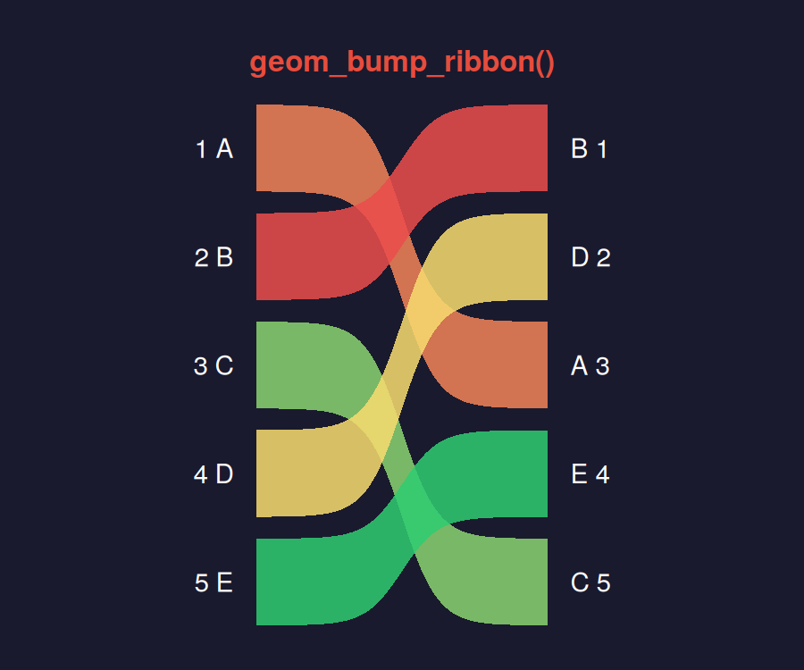
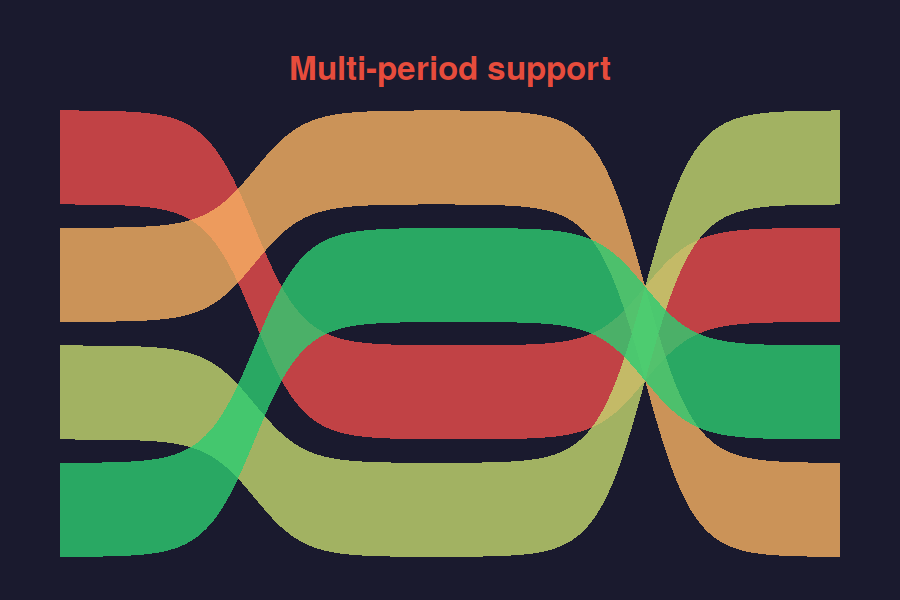
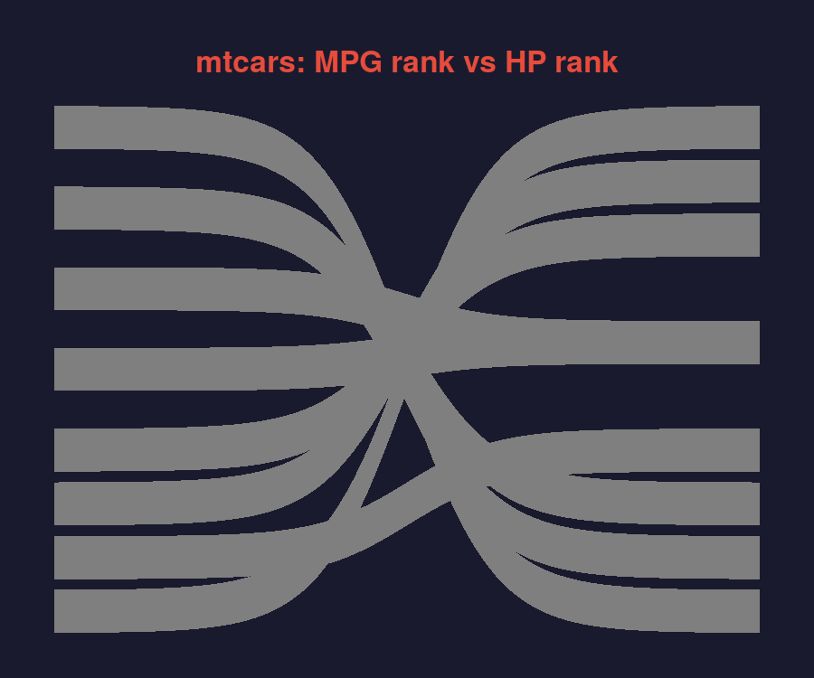

# ggbumpribbon

<!-- badges: start -->
[](https://github.com/sondreskarsten/ggbumpribbon/actions/workflows/R-CMD-check.yaml)
[](https://lifecycle.r-lib.org/articles/stages.html#experimental)
<!-- badges: end -->

Sigmoid-curved filled ribbons for rank comparison charts in ggplot2.



## The gap

| Package | What it does | What it lacks |
|---------|-------------|---------------|
| **ggbump** | Sigmoid *lines* via `geom_bump()` | No filled ribbons |
| **ggforce** | Bezier *ribbons* via `geom_diagonal_wide()` | Bezier, not sigmoid curve shape |
| **ggsankey** | Sankey-style ribbon bumps | *Stacked* positioning, not rank-positioned. GitHub-only |
| **ggbumpribbon** | **Sigmoid filled ribbons at exact rank positions** | — |

`geom_bump_ribbon()` implements a custom `StatBumpRibbon` that computes sigmoid-curved ribbon boundaries via logistic interpolation, delegating rendering to ggplot2's built-in `GeomRibbon`. This means faceting, coordinate transforms, legends, and all ggplot2 machinery work out of the box.

## Installation

```r
# install.packages("pak")
pak::pak("sondreskarsten/ggbumpribbon")
```

## Usage

The data format is long: one row per group per time point, with `x` (time), `y` (rank), and `group`.

### Basic: 2 time points

```r
library(ggplot2)
library(ggbumpribbon)

df <- data.frame(
  x     = rep(1:2, each = 5),
  y     = c(1, 2, 3, 4, 5, 3, 1, 5, 2, 4),
  group = rep(LETTERS[1:5], 2)
)

ggplot(df, aes(x, y, group = group, fill = after_stat(avg_y))) +
  geom_bump_ribbon(alpha = 0.85) +
  scale_fill_gradientn(
    colours = c("#2ecc71", "#f7dc6f", "#eb4d4b"),
    guide = "none"
  ) +
  scale_y_reverse() +
  theme_bump()
```

### Multi-period: 3+ time points

Ribbons chain automatically across segments:

```r
df3 <- data.frame(
  x     = rep(1:3, each = 4),
  y     = c(1,2,3,4, 3,1,4,2, 2,4,1,3),
  group = rep(LETTERS[1:4], 3)
)

ggplot(df3, aes(x, y, group = group, fill = after_stat(avg_y))) +
  geom_bump_ribbon(alpha = 0.7) +
  scale_fill_viridis_c() +
  scale_y_reverse()
```



### Built-in data: mtcars

```r
mt <- mtcars[1:10, ]
mt$car <- rownames(mt)

mt_long <- data.frame(
  x     = rep(1:2, each = 10),
  y     = c(rank(-mt$mpg), rank(-mt$hp)),
  group = rep(mt$car, 2)
)

ggplot(mt_long, aes(x, y, group = group, fill = after_stat(avg_y))) +
  geom_bump_ribbon() +
  scale_fill_rank(limits = c(1, 10)) +
  scale_y_reverse() +
  theme_bump()
```



## Parameters

| Parameter | Default | Description |
|-----------|---------|-------------|
| `smooth` | `8` | Steepness of the sigmoid curve. Higher = sharper S-shape |
| `width` | `0.8` | Ribbon full width in data units |
| `n` | `100` | Interpolation points per segment |
| `alpha` | `0.85` | Ribbon transparency |

## Computed variables

`StatBumpRibbon` computes these variables accessible via `after_stat()`:

| Variable | Description |
|----------|-------------|
| `avg_y` | Mean of all y values in the group — useful for rank-based fill gradients |
| `ymin` | Lower ribbon boundary |
| `ymax` | Upper ribbon boundary |

## Convenience functions

| Function | Description |
|----------|-------------|
| `scale_fill_rank()` | Green-yellow-red gradient scale with `guide = "none"` default |
| `theme_bump()` | Dark background theme for rank comparison infographics |

## Architecture

```
User data (x, y, group)
  → StatBumpRibbon$compute_group()
    → sigmoid_path() for upper/lower edges
    → returns data.frame(x, y, ymin, ymax, avg_y)
  → GeomRibbon renders filled polygons
```

No grid graphics code. The entire package is a data transformation that delegates to ggplot2's rendering pipeline.

## Dependencies

**Hard:** ggplot2 (>= 3.5.0), rlang, scales

rlang and scales are already installed as ggplot2 dependencies — zero additional installation burden.

## Contributing

See [CONTRIBUTING.md](CONTRIBUTING.md) for guidelines.

## License

MIT
