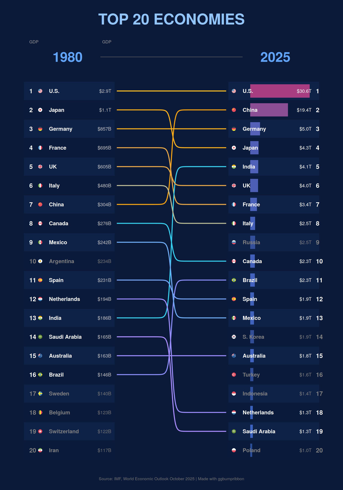

# ggbumpribbon

<!-- badges: start -->
[](https://github.com/sondreskarsten/ggbumpribbon/actions/workflows/R-CMD-check.yaml)
[](https://lifecycle.r-lib.org/articles/stages.html#experimental)
<!-- badges: end -->

Sigmoid-curved filled ribbons for rank comparison charts in ggplot2.

<a href="https://raw.githubusercontent.com/sondreskarsten/ggbumpribbon/main/man/figures/README-reputation.png"></a>

<details>
<summary>Code to reproduce</summary>

```r
library(ggplot2)
library(ggbumpribbon)
library(ggflags)
library(countrycode)

ranks <- data.frame(stringsAsFactors = FALSE,
  country   = c("Switzerland","Norway","Sweden","Canada","Denmark","New Zealand","Finland",
                "Australia","Ireland","Netherlands","Austria","Japan","Spain","Italy","Belgium",
                "Portugal","Greece","UK","Singapore","France","Germany","Czechia","Thailand",
                "Poland","South Korea","Malaysia","Indonesia","Peru","Brazil","U.S.","Ukraine",
                "Philippines","Morocco","Chile","Hungary","Argentina","Vietnam","Egypt","UAE",
                "South Africa","Mexico","Romania","India","Turkey","Qatar","Algeria","Ethiopia",
                "Colombia","Kazakhstan","Nigeria","Bangladesh","Israel","Saudi Arabia","Pakistan",
                "China","Iran","Iraq","Russia"),
  rank_from = c(1,2,3,4,5,6,7,8,9,10,11,12,13,14,15,16,17,18,19,20,21,22,23,24,25,26,27,28,
                29,30,31,32,33,34,35,36,37,38,39,40,41,42,43,44,45,51,47,49,50,52,53,54,55,56,
                57,58,59,60),
  rank_to   = c(1,3,4,2,6,7,5,11,10,9,12,8,14,13,17,15,16,18,19,21,20,25,24,23,31,29,34,27,
                28,48,26,33,30,35,32,38,37,36,40,42,39,41,45,43,44,46,51,50,49,52,54,55,53,56,
                57,59,58,60)
)

# countries only in one year get grey labels, no ribbon
exit_only  <- data.frame(country = c("Cuba","Venezuela"),  rank_from = c(46,48), stringsAsFactors = FALSE)
enter_only <- data.frame(country = c("Taiwan","Kuwait"),   rank_to   = c(22,47), stringsAsFactors = FALSE)

ov <- c("U.S."="us","UK"="gb","South Korea"="kr","Czechia"="cz","Taiwan"="tw","UAE"="ae")
iso <- function(x) ifelse(x %in% names(ov), ov[x],
  tolower(countrycode(x, "country.name", "iso2c", warn = FALSE)))

ranks$iso2      <- iso(ranks$country)
exit_only$iso2  <- iso(exit_only$country)
enter_only$iso2 <- iso(enter_only$country)

ranks_long <- data.frame(
  x       = rep(1:2, each = nrow(ranks)),
  y       = c(ranks$rank_from, ranks$rank_to),
  group   = rep(ranks$country, 2),
  country = rep(ranks$country, 2),
  iso2    = rep(ranks$iso2, 2)
)

lbl_l <- ranks_long[ranks_long$x == 1, ]
lbl_r <- ranks_long[ranks_long$x == 2, ]

ggplot(ranks_long, aes(x, y, group = group, fill = after_stat(avg_y))) +
  geom_bump_ribbon(alpha = 0.85, width = 0.8) +
  scale_fill_gradientn(
    colours = c("#2ecc71","#a8e063","#f7dc6f","#f0932b","#eb4d4b","#c0392b"),
    guide = "none"
  ) +
  scale_y_reverse(expand = expansion(mult = c(0.015, 0.015))) +
  scale_x_continuous(limits = c(0.15, 2.85)) +
  # left labels
  geom_text(data = lbl_l, aes(x = 0.94, y = y, label = y),
            inherit.aes = FALSE, hjust = 1, colour = "white", size = 2.2) +
  geom_flag(data = lbl_l, aes(x = 0.88, y = y, country = iso2),
            inherit.aes = FALSE, size = 3) +
  geom_text(data = lbl_l, aes(x = 0.82, y = y, label = country),
            inherit.aes = FALSE, hjust = 1, colour = "white", size = 2.2) +
  # right labels
  geom_text(data = lbl_r, aes(x = 2.06, y = y, label = y),
            inherit.aes = FALSE, hjust = 0, colour = "white", size = 2.2) +
  geom_flag(data = lbl_r, aes(x = 2.12, y = y, country = iso2),
            inherit.aes = FALSE, size = 3) +
  geom_text(data = lbl_r, aes(x = 2.18, y = y, label = country),
            inherit.aes = FALSE, hjust = 0, colour = "white", size = 2.2) +
  # exit only (grey, left)
  geom_text(data = exit_only, aes(x = 0.94, y = rank_from, label = rank_from),
            inherit.aes = FALSE, hjust = 1, colour = "grey55", size = 2.2) +
  geom_flag(data = exit_only, aes(x = 0.88, y = rank_from, country = iso2),
            inherit.aes = FALSE, size = 3) +
  geom_text(data = exit_only, aes(x = 0.82, y = rank_from, label = country),
            inherit.aes = FALSE, hjust = 1, colour = "grey55", size = 2.2) +
  # enter only (grey, right)
  geom_text(data = enter_only, aes(x = 2.06, y = rank_to, label = rank_to),
            inherit.aes = FALSE, hjust = 0, colour = "grey55", size = 2.2) +
  geom_flag(data = enter_only, aes(x = 2.12, y = rank_to, country = iso2),
            inherit.aes = FALSE, size = 3) +
  geom_text(data = enter_only, aes(x = 2.18, y = rank_to, label = country),
            inherit.aes = FALSE, hjust = 0, colour = "grey55", size = 2.2) +
  annotate("text", x = 1, y = -1.5, label = "2024 Rank",
           colour = "white", size = 4.5, fontface = "bold") +
  annotate("text", x = 2, y = -1.5, label = "2025 Rank",
           colour = "white", size = 4.5, fontface = "bold") +
  labs(
    title    = "COUNTRIES WITH THE BEST REPUTATIONS IN 2025",
    subtitle = "Reputation Lab ranked the reputations of 60 leading economies\nin 2025, shedding light on their international standing.",
    caption  = "Source: Reputation Lab | Made with ggbumpribbon"
  ) +
  theme_bump()
```

Flags require [ggflags](https://github.com/jimjam-slam/ggflags):
`install.packages("ggflags", repos = c("https://jimjam-slam.r-universe.dev", "https://cloud.r-project.org"))`

</details>

### `geom_bump_line()` — Top 20 Economies 1980 vs 2025

<a href="https://raw.githubusercontent.com/sondreskarsten/ggbumpribbon/main/man/figures/README-gdp.png"></a>

<details>
<summary>Code to reproduce</summary>

```r
library(ggplot2)
library(ggbumpribbon)
library(ggflags)
library(countrycode)

both <- data.frame(stringsAsFactors = FALSE,
  country   = c("U.S.","Japan","Germany","France","UK","Italy","China","Canada",
                "Mexico","Spain","Netherlands","India","Saudi Arabia","Australia","Brazil"),
  rank_from = c(1,2,3,4,5,6,7,8,9,11,12,13,14,15,16),
  rank_to   = c(1,4,3,7,6,8,2,10,13,12,18,5,19,15,11),
  gdp_1980  = c(2.9,1.1,0.857,0.695,0.605,0.480,0.304,0.276,
                0.242,0.231,0.194,0.186,0.165,0.163,0.146),
  gdp_2025  = c(30.6,4.3,5.0,3.4,4.0,2.5,19.4,2.3,1.9,1.9,1.3,4.1,1.3,1.8,2.3)
)

exit_only <- data.frame(stringsAsFactors = FALSE,
  country   = c("Argentina","Sweden","Belgium","Switzerland","Iran"),
  rank_from = c(10,17,18,19,20),
  gdp_1980  = c(0.234,0.140,0.123,0.122,0.117))

enter_only <- data.frame(stringsAsFactors = FALSE,
  country   = c("Russia","S. Korea","Turkey","Indonesia","Poland"),
  rank_to   = c(9,14,16,17,20),
  gdp_2025  = c(2.5,1.9,1.6,1.4,1.0))

ov <- c("U.S."="us","UK"="gb","S. Korea"="kr","Turkey"="tr")
iso <- function(x) ifelse(x %in% names(ov), ov[x],
  tolower(countrycode(x, "country.name", "iso2c", warn = FALSE)))

both$iso2       <- iso(both$country)
exit_only$iso2  <- iso(exit_only$country)
enter_only$iso2 <- iso(enter_only$country)

# 4 x-values → 3-bend "exit–channel–enter" pattern
both_long <- data.frame(
  x       = rep(c(1, 1.35, 1.65, 2), each = nrow(both)),
  y       = c(both$rank_from, both$rank_from, both$rank_to, both$rank_to),
  group   = rep(both$country, 4),
  country = rep(both$country, 4),
  iso2    = rep(both$iso2, 4)
)

lbl_l <- both_long[both_long$x == 1, ]
lbl_r <- both_long[both_long$x == 2, ]

fmt_gdp <- function(x) ifelse(x >= 1,
  paste0("$", formatC(x, format = "f", digits = 1), "T"),
  paste0("$", round(x * 1000), "B"))

both$gdp_l_label     <- fmt_gdp(both$gdp_1980)
both$gdp_r_label     <- fmt_gdp(both$gdp_2025)
exit_only$gdp_label  <- fmt_gdp(exit_only$gdp_1980)
enter_only$gdp_label <- fmt_gdp(enter_only$gdp_2025)

gdp_max   <- 31
bar_left  <- 2.22
bar_width <- 0.55
bars_r <- data.frame(y = both$rank_to, xmin = bar_left,
  xmax = bar_left + bar_width * (both$gdp_2025 / gdp_max), gdp = both$gdp_2025)
bars_enter <- data.frame(y = enter_only$rank_to, xmin = bar_left,
  xmax = bar_left + bar_width * (enter_only$gdp_2025 / gdp_max), gdp = enter_only$gdp_2025)

row_bg_l <- data.frame(y = 1:20, xmin = 0.15, xmax = 0.98,
  fill = ifelse(1:20 %% 2 == 0, "#0a1a3a", "#0e2248"))
row_bg_r <- data.frame(y = 1:20, xmin = 2.02, xmax = 2.85,
  fill = ifelse(1:20 %% 2 == 0, "#0a1a3a", "#0e2248"))

bg <- "#0b1a38"

ggplot() +
  # alternating row backgrounds
  geom_rect(data = row_bg_l,
    aes(xmin = xmin, xmax = xmax, ymin = y - 0.48, ymax = y + 0.48),
    fill = row_bg_l$fill, colour = NA) +
  geom_rect(data = row_bg_r,
    aes(xmin = xmin, xmax = xmax, ymin = y - 0.48, ymax = y + 0.48),
    fill = row_bg_r$fill, colour = NA) +
  # GDP bar segments (blue→pink gradient proportional to GDP)
  geom_rect(data = bars_r,
    aes(xmin = xmin, xmax = xmax, ymin = y - 0.35, ymax = y + 0.35),
    fill = scales::seq_gradient_pal("#3b82f6", "#ec4899")(bars_r$gdp / gdp_max),
    colour = NA, alpha = 0.7) +
  geom_rect(data = bars_enter,
    aes(xmin = xmin, xmax = xmax, ymin = y - 0.35, ymax = y + 0.35),
    fill = scales::seq_gradient_pal("#3b82f6", "#ec4899")(bars_enter$gdp / gdp_max),
    colour = NA, alpha = 0.5) +
  # 3-bend sigmoid lines
  geom_bump_line(data = both_long,
    aes(x = x, y = y, group = group, colour = after_stat(avg_y)),
    linewidth = 0.7, smooth = 10) +
  scale_colour_gradientn(
    colours = c("#fbbf24","#f59e0b","#22d3ee","#818cf8","#a78bfa"),
    guide = "none") +
  scale_y_reverse(expand = expansion(mult = c(0.03, 0.03))) +
  scale_x_continuous(limits = c(0.12, 2.88)) +
  # left: rank + flag + name + GDP
  geom_text(data = lbl_l, aes(x = 0.20, y = y, label = y),
    inherit.aes = FALSE, hjust = 0, colour = "white", size = 3.2, fontface = "bold") +
  geom_flag(data = lbl_l, aes(x = 0.30, y = y, country = iso2),
    inherit.aes = FALSE, size = 2.5) +
  geom_text(data = lbl_l, aes(x = 0.38, y = y, label = country),
    inherit.aes = FALSE, hjust = 0, colour = "white", size = 2.8, fontface = "bold") +
  geom_text(data = both, aes(x = 0.95, y = rank_from, label = gdp_l_label),
    inherit.aes = FALSE, hjust = 1, colour = "grey75", size = 2.5) +
  # right: flag + name + GDP + rank
  geom_flag(data = lbl_r, aes(x = 2.07, y = y, country = iso2),
    inherit.aes = FALSE, size = 2.5) +
  geom_text(data = lbl_r, aes(x = 2.15, y = y, label = country),
    inherit.aes = FALSE, hjust = 0, colour = "white", size = 2.8, fontface = "bold") +
  geom_text(data = both, aes(x = 2.78, y = rank_to, label = gdp_r_label),
    inherit.aes = FALSE, hjust = 1, colour = "white", size = 2.5) +
  geom_text(data = lbl_r, aes(x = 2.82, y = y, label = y),
    inherit.aes = FALSE, hjust = 0, colour = "white", size = 3.2, fontface = "bold") +
  # exit only (grey left)
  geom_text(data = exit_only, aes(x = 0.20, y = rank_from, label = rank_from),
    inherit.aes = FALSE, hjust = 0, colour = "grey50", size = 3.2, fontface = "bold") +
  geom_flag(data = exit_only, aes(x = 0.30, y = rank_from, country = iso2),
    inherit.aes = FALSE, size = 2.5) +
  geom_text(data = exit_only, aes(x = 0.38, y = rank_from, label = country),
    inherit.aes = FALSE, hjust = 0, colour = "grey50", size = 2.8, fontface = "bold") +
  geom_text(data = exit_only, aes(x = 0.95, y = rank_from, label = gdp_label),
    inherit.aes = FALSE, hjust = 1, colour = "grey45", size = 2.5) +
  # enter only (grey right)
  geom_flag(data = enter_only, aes(x = 2.07, y = rank_to, country = iso2),
    inherit.aes = FALSE, size = 2.5) +
  geom_text(data = enter_only, aes(x = 2.15, y = rank_to, label = country),
    inherit.aes = FALSE, hjust = 0, colour = "grey50", size = 2.8, fontface = "bold") +
  geom_text(data = enter_only, aes(x = 2.78, y = rank_to, label = gdp_label),
    inherit.aes = FALSE, hjust = 1, colour = "grey50", size = 2.5) +
  geom_text(data = enter_only, aes(x = 2.82, y = rank_to, label = rank_to),
    inherit.aes = FALSE, hjust = 0, colour = "grey50", size = 3.2, fontface = "bold") +
  # column headers
  annotate("text", x = 0.55, y = -0.8, label = "1980",
    colour = "#60a5fa", size = 7, fontface = "bold") +
  annotate("text", x = 2.45, y = -0.8, label = "2025",
    colour = "#60a5fa", size = 7, fontface = "bold") +
  annotate("segment", x = 0.85, xend = 2.15, y = -0.8, yend = -0.8,
    colour = "grey40", linewidth = 0.3) +
  labs(
    title   = "TOP 20 ECONOMIES",
    caption = "Source: IMF, World Economic Outlook October 2025 | Made with ggbumpribbon"
  ) +
  theme_void() +
  theme(
    plot.background  = element_rect(fill = bg, colour = NA),
    panel.background = element_rect(fill = bg, colour = NA),
    plot.title       = element_text(colour = "#93c5fd", size = 22, face = "bold",
                                    hjust = 0.5, margin = margin(t = 12, b = 2)),
    plot.caption     = element_text(colour = "grey45", size = 6,
                                    hjust = 0.5, margin = margin(t = 8, b = 5)),
    plot.margin      = margin(8, 8, 8, 8)
  )
```

</details>

## The gap

| Package | What it does | What it lacks |
|---------|-------------|---------------|
| **ggbump** | Sigmoid *lines* via `geom_bump()` | No filled ribbons |
| **ggforce** | Bezier *ribbons* via `geom_diagonal_wide()` | Bezier, not sigmoid curve shape |
| **ggsankey** | Sankey-style ribbon bumps | *Stacked* positioning, not rank-positioned. GitHub-only |
| **ggbumpribbon** | **Sigmoid filled ribbons at exact rank positions** | — |

## Installation

```r
# install.packages("pak")
pak::pak("sondreskarsten/ggbumpribbon")
```

## Minimal example

```r
library(ggplot2)
library(ggbumpribbon)

df <- data.frame(
  x     = rep(1:2, each = 5),
  y     = c(1, 2, 3, 4, 5, 3, 1, 5, 2, 4),
  group = rep(LETTERS[1:5], 2)
)

ggplot(df, aes(x, y, group = group, fill = after_stat(avg_y))) +
  geom_bump_ribbon(alpha = 0.85) +
  scale_fill_viridis_c(guide = "none") +
  scale_y_reverse() +
  theme_void()
```


## Multi-period

Ribbons chain automatically across 3+ time points:

```r
df3 <- data.frame(
  x     = rep(1:3, each = 4),
  y     = c(1,2,3,4, 3,1,4,2, 2,4,1,3),
  group = rep(LETTERS[1:4], 3)
)

ggplot(df3, aes(x, y, group = group, fill = after_stat(avg_y))) +
  geom_bump_ribbon(alpha = 0.7) +
  scale_fill_viridis_c() +
  scale_y_reverse()
```


## mtcars

```r
mt <- mtcars[1:10, ]
mt$car <- rownames(mt)

mt_long <- data.frame(
  x     = rep(1:2, each = 10),
  y     = c(rank(-mt$mpg), rank(-mt$hp)),
  group = rep(mt$car, 2)
)

ggplot(mt_long, aes(x, y, group = group, fill = after_stat(avg_y))) +
  geom_bump_ribbon() +
  scale_fill_rank(limits = c(1, 10)) +
  scale_y_reverse() +
  theme_bump()
```


## Parameters

| Parameter | Default | Description |
|-----------|---------|-------------|
| `smooth` | `8` | Steepness of the sigmoid curve. Higher = sharper S-shape |
| `width` | `0.8` | Ribbon full width in data units |
| `n` | `100` | Interpolation points per segment |
| `alpha` | `0.85` | Ribbon transparency |

## Computed variables

| Variable | Description |
|----------|-------------|
| `avg_y` | Mean of all y values in the group — useful for rank-based fill via `after_stat(avg_y)` |
| `ymin` | Lower ribbon boundary |
| `ymax` | Upper ribbon boundary |

## Convenience functions

| Function | Description |
|----------|-------------|
| `scale_fill_rank()` | Green-yellow-red gradient scale with `guide = "none"` default |
| `theme_bump()` | Dark background theme for rank comparison infographics |

## Architecture

```
User data (x, y, group)
  → StatBumpRibbon$compute_group()
    → sigmoid_path() for upper/lower edges
    → returns data.frame(x, y, ymin, ymax, avg_y)
  → GeomRibbon renders filled polygons
```

## Dependencies

**Hard:** ggplot2 (>= 3.5.0), rlang, scales — rlang and scales are already ggplot2 dependencies.

## License

MIT
