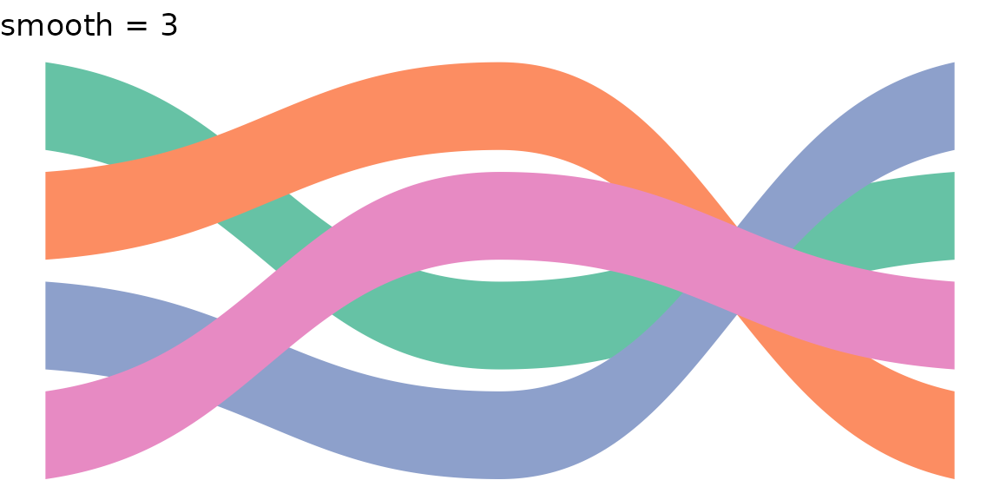
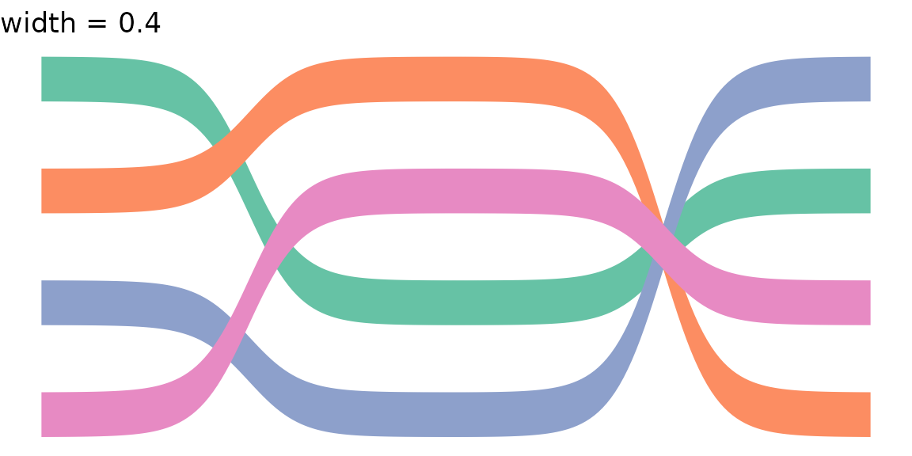
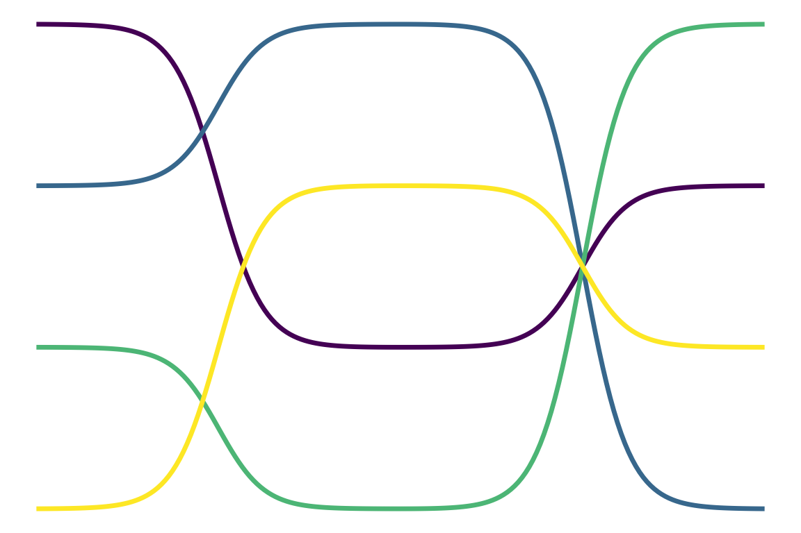
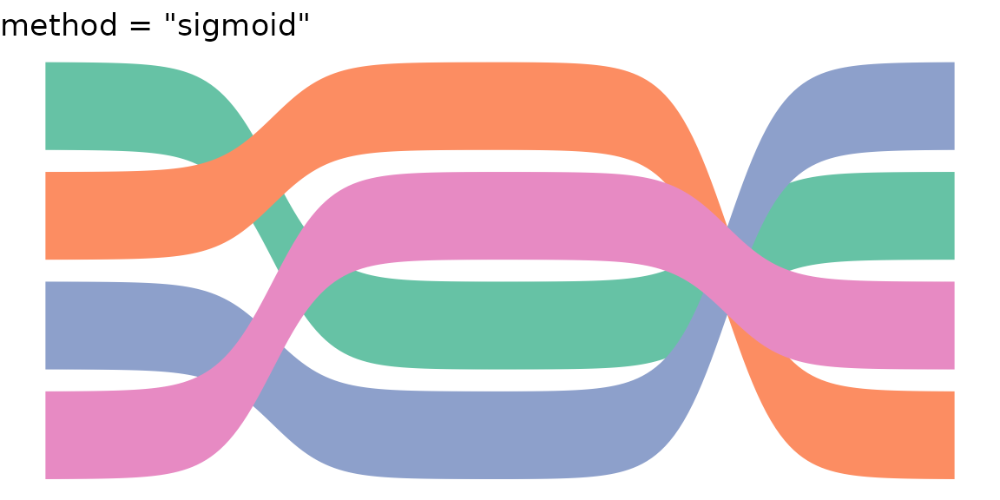
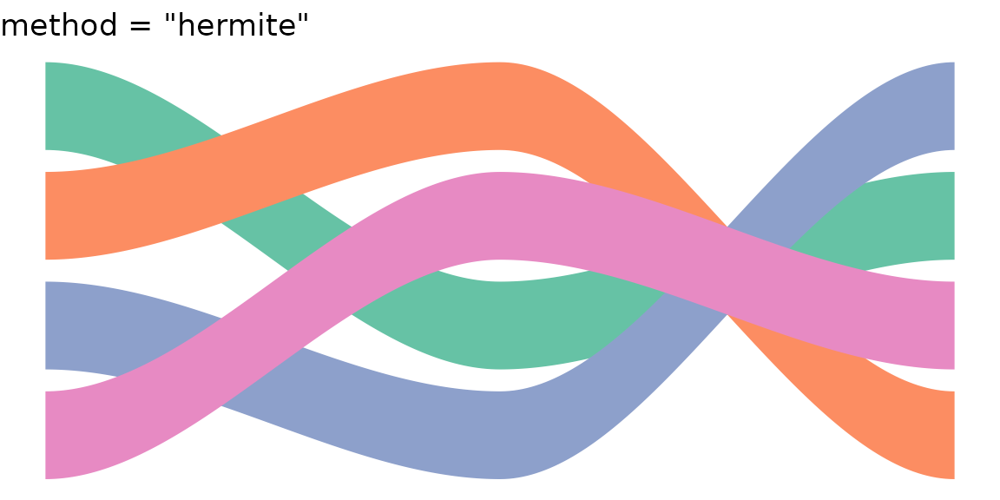
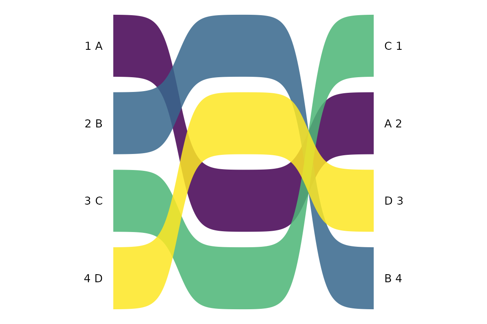
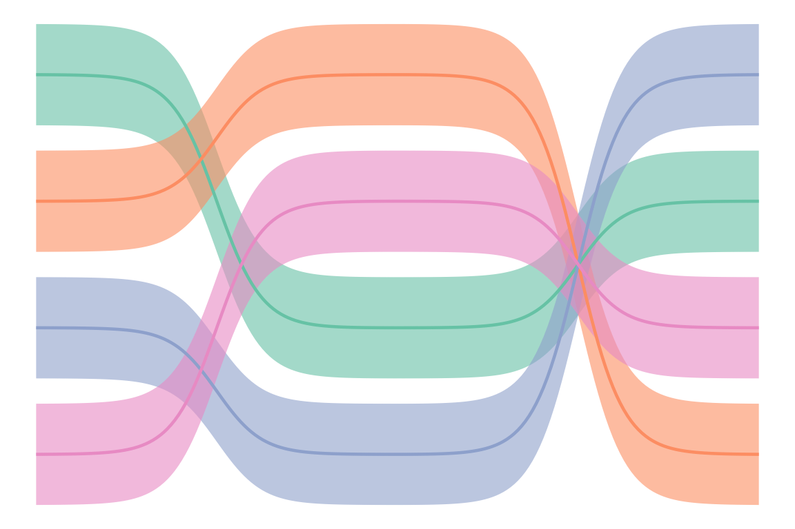

# Getting started with ggbumpribbon

``` r
library(ggbumpribbon)
library(ggplot2)
```

## Data format

Both
[`geom_bump_ribbon()`](https://sondreskarsten.github.io/ggbumpribbon/reference/geom_bump_ribbon.md)
and
[`geom_bump_line()`](https://sondreskarsten.github.io/ggbumpribbon/reference/geom_bump_line.md)
expect a long-format data frame with columns for position (`x`), rank
(`y`), and a grouping variable. Each group must have at least two
x-values.

``` r
df <- data.frame(
  x     = rep(1:3, each = 4),
  y     = c(1,2,3,4, 3,1,4,2, 2,4,1,3),
  group = rep(LETTERS[1:4], 3)
)
df
#>    x y group
#> 1  1 1     A
#> 2  1 2     B
#> 3  1 3     C
#> 4  1 4     D
#> 5  2 3     A
#> 6  2 1     B
#> 7  2 4     C
#> 8  2 2     D
#> 9  3 2     A
#> 10 3 4     B
#> 11 3 1     C
#> 12 3 3     D
```

## Filled ribbons

[`geom_bump_ribbon()`](https://sondreskarsten.github.io/ggbumpribbon/reference/geom_bump_ribbon.md)
renders each group as a filled area with smooth sigmoid curves between
rank positions. The `fill` aesthetic controls colour; mapping
`after_stat(avg_y)` produces gradient fills based on mean rank.

``` r
ggplot(df, aes(x, y, group = group, fill = after_stat(avg_y))) +
  geom_bump_ribbon(alpha = 0.85) +
  scale_fill_viridis_c(guide = "none") +
  scale_y_reverse() +
  theme_void()
```


### Parameters

The `smooth` parameter controls sigmoid steepness (higher = sharper),
`width` sets the ribbon thickness in data units, and `n` controls
interpolation density.

``` r
p_base <- ggplot(df, aes(x, y, group = group, fill = group)) +
  scale_fill_brewer(palette = "Set2", guide = "none") +
  scale_y_reverse() + theme_void()

p_base + geom_bump_ribbon(smooth = 3) + ggtitle("smooth = 3")
```



``` r
p_base + geom_bump_ribbon(smooth = 15) + ggtitle("smooth = 15")
```


``` r
p_base + geom_bump_ribbon(width = 0.4) + ggtitle("width = 0.4")
```



## Lines

[`geom_bump_line()`](https://sondreskarsten.github.io/ggbumpribbon/reference/geom_bump_line.md)
renders the same sigmoid curves as stroked paths. Map `colour` instead
of `fill`.

``` r
ggplot(df, aes(x, y, group = group, colour = after_stat(avg_y))) +
  geom_bump_line(linewidth = 1.2) +
  scale_colour_viridis_c(guide = "none") +
  scale_y_reverse() +
  theme_void()
```



## Interpolation methods

Both geoms accept a `method` parameter. The default `"sigmoid"` uses
logistic S-curves with C1-continuous derivative correction at segment
joins. The alternative `"hermite"` uses cubic Hermite interpolation via
[`stats::splinefunH()`](https://rdrr.io/r/stats/splinefun.html) with
zero slopes at knots.

``` r
ggplot(df, aes(x, y, group = group, fill = group)) +
  geom_bump_ribbon(method = "sigmoid") +
  scale_fill_brewer(palette = "Set2", guide = "none") +
  scale_y_reverse() + ggtitle('method = "sigmoid"') + theme_void()
```



``` r
ggplot(df, aes(x, y, group = group, fill = group)) +
  geom_bump_ribbon(method = "hermite") +
  scale_fill_brewer(palette = "Set2", guide = "none") +
  scale_y_reverse() + ggtitle('method = "hermite"') + theme_void()
```



## Scale and theme

[`scale_fill_rank()`](https://sondreskarsten.github.io/ggbumpribbon/reference/scale_fill_rank.md)
provides a green-yellow-red gradient with `guide = "none"`, defaulting
to auto-range from the data.
[`theme_bump()`](https://sondreskarsten.github.io/ggbumpribbon/reference/theme_bump.md)
gives a dark background suited to rank comparison infographics.

``` r
ggplot(df, aes(x, y, group = group, fill = after_stat(avg_y))) +
  geom_bump_ribbon() +
  scale_fill_rank() +
  scale_y_reverse() +
  theme_bump()
```


## Labels

Add rank labels with standard ggplot2 layers. A typical pattern:

``` r
lbl_l <- df[df$x == 1, ]
lbl_r <- df[df$x == 3, ]

ggplot(df, aes(x, y, group = group, fill = after_stat(avg_y))) +
  geom_bump_ribbon(alpha = 0.85) +
  scale_fill_viridis_c(guide = "none") +
  scale_y_reverse() +
  scale_x_continuous(limits = c(0.3, 3.7)) +
  geom_text(data = lbl_l, aes(x = 0.92, y = y, label = paste(y, group)),
            inherit.aes = FALSE, hjust = 1, size = 3.5) +
  geom_text(data = lbl_r, aes(x = 3.08, y = y, label = paste(group, y)),
            inherit.aes = FALSE, hjust = 0, size = 3.5) +
  theme_void()
```



## Combining ribbons and lines

Overlay
[`geom_bump_line()`](https://sondreskarsten.github.io/ggbumpribbon/reference/geom_bump_line.md)
on top of
[`geom_bump_ribbon()`](https://sondreskarsten.github.io/ggbumpribbon/reference/geom_bump_ribbon.md)
for a bordered appearance:

``` r
ggplot(df, aes(x, y, group = group)) +
  geom_bump_ribbon(aes(fill = group), alpha = 0.6) +
  geom_bump_line(aes(colour = group), linewidth = 0.8) +
  scale_fill_brewer(palette = "Set2", guide = "none") +
  scale_colour_brewer(palette = "Set2", guide = "none") +
  scale_y_reverse() +
  theme_void()
```



## Computed variables

`StatBumpRibbon` computes `avg_y` (group mean rank, inverse-transformed
for
[`scale_y_reverse()`](https://ggplot2.tidyverse.org/reference/scale_continuous.html)
compatibility), `ymin`, and `ymax`. `StatBumpLine` computes `avg_y`
only.

``` r
group_data <- data.frame(x = 1:3, y = c(1, 5, 2))
out <- StatBumpRibbon$compute_group(group_data, NULL, smooth = 8,
                                     n = 50, width = 0.8)
head(out)
#>          x        y      ymin     ymax    avg_y
#> 1 1.000000 1.000000 0.6000000 1.400000 2.666667
#> 2 1.020408 1.000527 0.6005268 1.400527 2.666667
#> 3 1.040816 1.001270 0.6012703 1.401270 2.666667
#> 4 1.061224 1.002306 0.6023063 1.402306 2.666667
#> 5 1.081633 1.003740 0.6037402 1.403740 2.666667
#> 6 1.102041 1.005718 0.6057181 1.405718 2.666667
```
